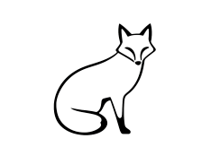

<div align="center">



# Eloy Browser

**basically librewolf but even less bloat**

[](LICENSE) []

*also how did you end up here?*

</div>

---

## What is this?

IDK, I'm making a cool browser based on LibreWolf. The goal? Remove the bloat, keep it simple, and make browsing fast and private.

It's just a little project, but if you're into minimal browsers with good privacy, you might like it.

**The idea:**
- No telemetry or tracking stuff
- Fast and lightweight
- Based on LibreWolf (which is already pretty good)
- Just a browser, nothing fancy

## What's different?

- No tracking or telemetry
- Faster than your average bloated browser
- Clean interface (no unnecessary buttons everywhere)
- All the LibreWolf privacy features
- Actually lightweight

## Download

Alpha builds are in the [`EloyAlphaBuilds`](EloyAlphaBuilds/) folder. These are early versions, so expect some bugs.

Check [System Requirements](System%20Requirements.md) to see if your system can run it.

## Building it yourself

The source code is in `EloyAlphaBuilds/librewolf-source/`

```bash
# Clone the repo
git clone https://github.com/Tekalu-Tech/Eloy-Browser.git
cd Eloy-Browser

# Go to the source
cd EloyAlphaBuilds/librewolf-source

# Build it (you'll need the usual browser build tools)
# Follow LibreWolf's build instructions
```

You'll need the standard browser build tools (Git, Python, etc.). It's basically the same as building LibreWolf.

## What's in here?

```
Eloy-Browser/
├── EloyAlphaBuilds/           # Alpha builds and source code
│   └── librewolf-source/      # The actual source (build from here!)
├── Website/                   # Project website
├── WebsiteClaude/            # Another website version
├── website-react/            # React website
├── source/                   # Old source location
├── starborn/                 # Some other stuff
├── default*.png              # Icons
└── LogoMain.png             # Main logo
```

## Website

There's a website somewhere in those folders. Multiple versions actually, because why not.

## Contributing

Want to help? Cool!

- Found a bug? Open an issue
- Have an idea? Open an issue
- Want to fix something? Make a pull request
- Just want to chat? That works too

No fancy guidelines, just be reasonable.

## License

MPL-2.0 - see the [LICENSE](LICENSE) file. 

Basically you can use it, modify it, and share it. Just follow the license terms.

## Thanks to

- LibreWolf team for the base
- Mozilla for Firefox
- Anyone who stumbles upon this and actually uses it

## Roadmap (maybe)

- [ ] Finish alpha testing
- [ ] Add some custom features
- [ ] Make it work on all platforms
- [ ] Stable release someday
- [ ] Whatever else seems cool

## Current Status

It's in alpha. Things might break. Don't rely on it for anything critical yet.

---

<div align="center">

**Made by Tekalu-Tech and Br34thless**

Star it if you want ⭐

</div>
